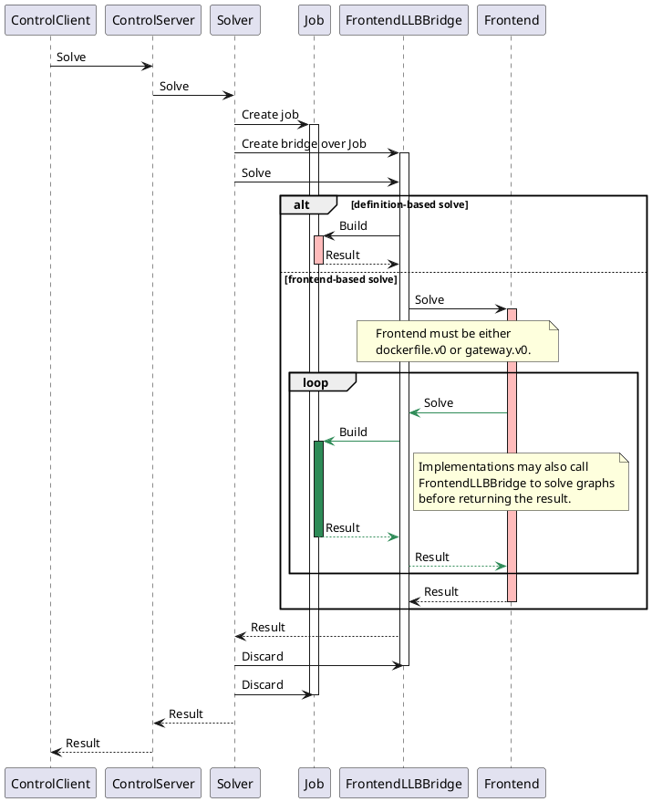
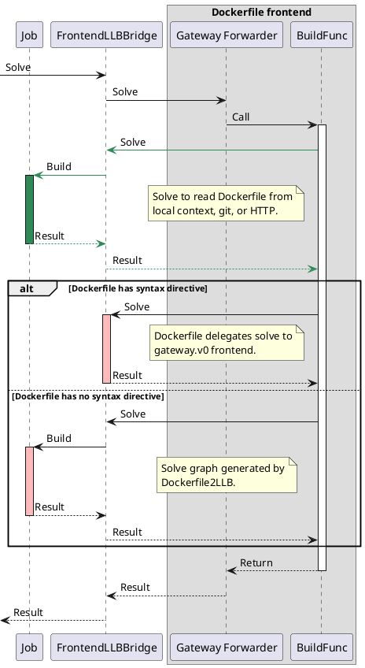
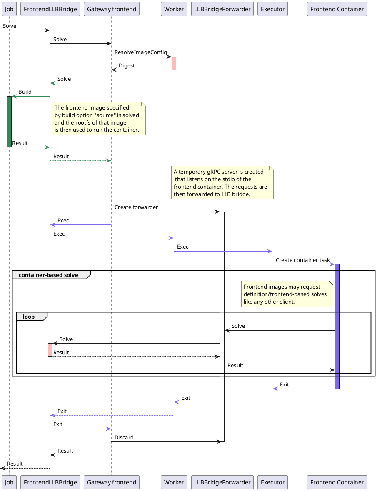

# Solve Request Lifecycle

Buildkit solves build graphs to find the final result. By default, nothing will
be exported to the client, but requests can be made after solving the graph to
export results to external destinations (like the client’s filesystem).

A solve request goes through the following:

1. Client makes a solve request and sends it to buildkitd over gRPC. The
   request may either include a LLB definition, or the name of a frontend (must
   be `dockerfile.v0` or `gateway.v0`), but it must not be both.
2. Buildkitd receives the solve request with the Controller. The controller is
   registered as the ControlServer gRPC service.
3. The controller passes it down to the LLB solver, which will create a job for
   this request. It will also create a FrontendLLBBridge, that provides a
   solving interface over the job object.
4. The request is processed:
   - If the request is definition-based, it will simply build the definition.
   - If the request is frontend-based, it will run the frontend over the
     gateway while passing it a reference to the FrontendLLBBridge. Frontends
     must return a result for the solve request, but they may also issue solve
     requests themselves to the bridge.
5. The results are plumbed back to the client, and the temporary job and bridge
   are discarded.

> Diagram from <https://gist.github.com/hinshun/9618a3c4b64b3bb16864603ef332f3a5>

An important detail is that frontends may also issue solve requests, which are
often definition-based solves, but can also be frontend-based solves, allowing
for composability of frontends. Note that if a frontend makes a frontend-based
solve request, they will share the same FrontendLLBBridge and underlying job.

## Dockerfile frontend (`dockerfile.v0`)

Buildkit comes with a Dockerfile frontend which essentially is a parser that
translates Dockerfile instructions into a LLB definition. In order to introduce
new features into the Dockerfile DSL without breaking backwards compatibility,
Dockerfiles can include a syntax directive at the top of the file to indicate a
frontend image to use.

For example, users can include a syntax directive to use
`docker/dockerfile:1-labs` to opt-in for an extended Dockerfile DSL that
takes advantage of Buildkit features. However, the frontend image doesn’t have
to be Dockerfile-specific. One can write a frontend that reads a YAML file, and
using the syntax directive, issue the build request using `docker build -f
my-config.yaml`.

The lifecycle of a `dockerfile.v0` frontend-based solve request goes through
the following:

1. Starting from the "frontend-based solve" path, the bridge looks up the
   Dockerfile frontend if the frontend key is `dockerfile.v0`, and requests a
   solve to the frontend. The gateway forwarder implements the frontend
   interface and wraps over a BuildFunc that builds Dockerfiles.
2. The BuildFunc issues a solve request to read the Dockerfile from a source
   (local context, git, or HTTP), and parses it to find a syntax directive.
   - If a syntax directive is found, it delegates the solve to the `gateway.v0`
     frontend.
   - If a syntax directive is not found, then it parses the Dockerfile
     instructions and builds an LLB. The LLB is marshaled into a definition and
     sent in a solve request.

> Diagram from <https://gist.github.com/hinshun/2c18e16b07b38049bac72a4b602985b5>

## Gateway frontend (`gateway.v0`)

The gateway frontend allows external frontends to be implemented as container
images, allowing for a pluggable architecture. The container images have access
to the gRPC service through stdin/stdout. The easiest way to implement a
frontend image is to create a golang binary that vendors buildkit because they
have a convenient LLB builders and utilities.

The lifecycle of a `gateway.v0` frontend-based solve request goes through the
following:

1. Starting from the "frontend-based solve" path, the bridge looks up the
   Gateway frontend if the frontend key is `gateway.v0`, and requests a solve
   to the frontend.
2. The gateway frontend resolves a frontend image from the `source` key
   and solves the request to retrieve the rootfs for the image.
3. A temporary gRPC server is created that forwards requests to the LLB bridge.
4. A container using the frontend image rootfs is created, and a gRPC
   connection is established from a process inside the container to the
   temporary bridge forwarder.
5. The frontend image is then able to build LLBs and send solve requests
   through the forwarder.
6. The container exits, and then the results are plumbed back to the LLB
   bridge, which plumbs them back to the client.

> Diagram from <https://gist.github.com/hinshun/ecf554c32522fc94a33488b353230b27>
