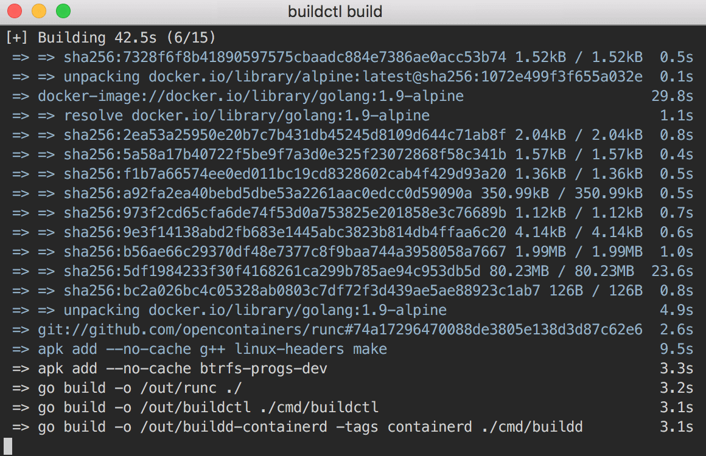

# Introduction

!!! note
    See the original blog post: [Introducing BuildKit](user-guides/blog-posts.md).

BuildKit is a project for building and packaging software using containers.
It's a new codebase meant to replace the internals of the current build features
in the Moby Engine.

BuildKit emerged from the discussions about improving the build features in
Moby Engine. We received a lot of positive feedback for the multi-stage build
feature introduced in April and had proposals and user requests for many similar
additions. But before that, we needed to make sure that we have capabilities to
continue adding such features in the future and a solid foundation to extend on.
Quite soon it was clear that we would need to redefine most of the fundamentals
about how we even define a build operation and needed a clean break from the
current codebase. A [proposal](https://github.com/moby/moby/issues/32925) was
written, and development started in the open under the
[new repository](https://github.com/moby/buildkit).

In parallel, work had started on the new container runtime [containerd](https://github.com/containerd/containerd/)
1.0, so BuildKit is based on the work done in that repository. For example, it
uses containerd snapshot, execution and image libraries. BuildKit can also be
built in a version that tightly integrates with containerd, using an existing
containerd daemon for the storage and sharing it with other containerd clients.

Apart from many new features, the main areas BuildKit improves on the current
experience are performance, storage management, and extensibility. From the
performance side, a significant update is a new fully concurrent build graph
solver. It can run build steps in parallel when possible and optimize out
commands that don’t have an impact on the final result. We have also optimized
the access to the local source files. By tracking only the updates made to these
files between repeated build invocations, there is no need to wait for local
files to be read or uploaded before the work can begin.

## LLB

At the core of BuildKit is a new low-level build definition format called LLB
(low-level builder). This is an intermediate binary format that end users are
not exposed to but allows to easily build on top of BuildKit. LLB defines a
content-addressable dependency graph that can be used to put together very
complex build definitions. It also supports features not exposed in Dockerfiles,
like direct data mounting and nested invocation.

Everything about execution and caching of your builds is defined only in LLB.
The caching model is entirely rewritten compared to the current Dockerfile
builder. Instead of doing heuristics to compare images, it can directly track
the checksums of build graphs and content mounted to specific operations. This
makes it much faster, more precise and portable. The build cache can even be
exported to a registry, where it can be pulled on-demand by subsequent
invocations on any host.

LLB can be generated directly using a [golang client package](https://pkg.go.dev/github.com/moby/buildkit/client/llb)
that allows defining the relationships between your build operations using Go
language primitives. This gives you full power to run anything you can imagine,
but will probably not be how most people will define their builds. Instead, we
expect most users to use a frontend component or LLB nested invocation to run
some prepared combination of build steps.

A [frontend](frontend/overview.md) is a component that takes a human-readable
build format and converts it to LLB so BuildKit can execute it. Frontends can
be distributed as images, and the user can target a specific version of a
frontend that is guaranteed to work for the features used by their definition.
For example, to [build a Dockerfile with BuildKit](frontend/dockerfile.md#build-a-dockerfile-with-an-external-dockerfile-frontend),
you would [use an external Dockerfile frontend](frontend/dockerfile.md#using-an-external-dockerfile-frontend).
